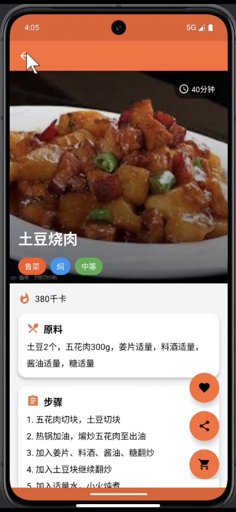
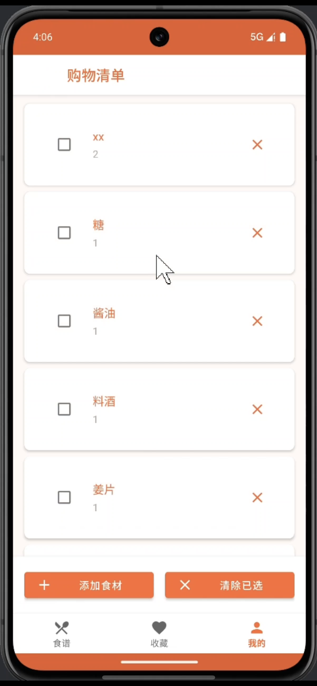

# CookApp | 智能食谱手册

一款以本地数据为核心的 Android 食谱应用。可浏览菜谱、按菜系筛选、收藏菜谱、安排每日菜单，并把食材加入购物清单。推荐页结合做菜历史与菜谱属性给出排序和推荐理由。

## 界面预览

| 食谱列表 | 收藏与筛选 | 食谱详情 | 购物清单 |
| :---: | :---: | :---: | :---: |
|  |  |  |  |

## 主要功能

- 浏览和筛选预置食谱，查看用料、步骤、耗时与热量。
- 根据烹饪历史生成个性化推荐；支持收藏和分享食谱。
- 按日期、餐次安排菜单，将所需食材加入购物清单。
- 本地账号注册、登录和修改密码；数据保存在设备上的 Room 数据库中。

## 技术与运行环境

- Android 应用：Java、AndroidX、Material Components、Navigation、Room、Glide。
- 数据库版本：**11**；迁移定义和导出的 schema 位于 `app/src/main/java/com/example/cookapp/database/` 与 `app/schemas/`。
- 编译 SDK / 目标 SDK：34；最低 SDK：24；JDK：17；Gradle Wrapper：8.13。
- 使用 Android Studio 打开本目录，安装 Android SDK 34 并将 Gradle JDK 设为 17。IDE 会创建机器专属的 `local.properties`，此文件不会纳入 Git。

首次运行后，可使用内置演示账号登录：用户名 `test`，密码 `123456`。首次安装会初始化食谱及演示数据。也可以自行注册本地账号。

在项目根目录运行：

```powershell
# Windows PowerShell
.\gradlew.bat testDebugUnitTest assembleDebug
```

```bash
# macOS / Linux
bash ./gradlew testDebugUnitTest assembleDebug
```

Debug APK 位于 `app/build/outputs/apk/debug/`。连接模拟器或设备后，可单独运行 `connectedDebugAndroidTest` 执行设备端冒烟测试。GitHub Actions 会对每次推送和 PR 执行单元测试及 Debug 构建，不要求连接设备。

## 目录

```text
app/src/main/       应用代码与资源
app/src/test/       本地单元测试
app/src/androidTest/ 设备端测试
app/schemas/        Room 数据库 schema 历史
docs/screenshots/   应用界面截图
gradle/             Gradle 版本配置与 Wrapper
```

## 已知限制

这是用于学习和展示的项目，**不适合直接用于生产环境**：账号密码目前以明文保存在本地数据库中，且应用预置了公开的演示账号。数据没有云同步；仓库不包含签名密钥或正式发布包。菜品图片与截图已确认可用于本项目公开展示，复用素材前请自行核实相应权利。

本仓库暂未提供 LICENSE；公开展示不代表授权他人复制、修改或重新分发源码。
